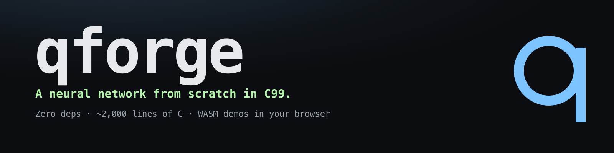
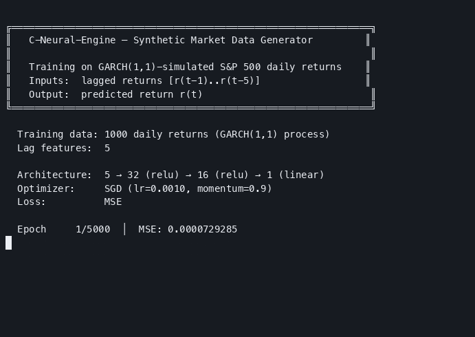
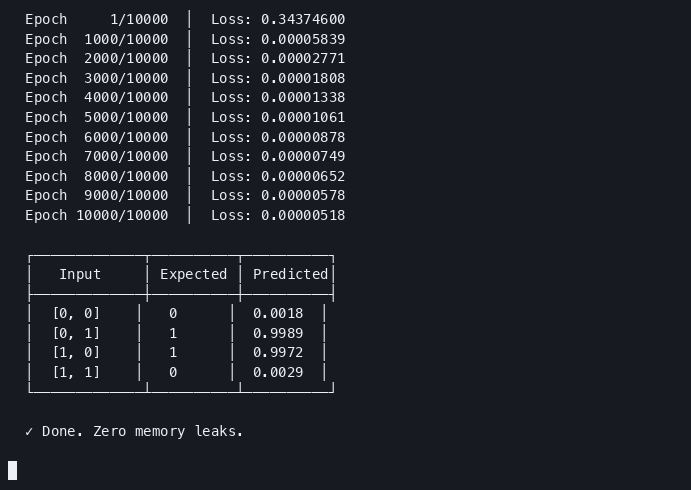
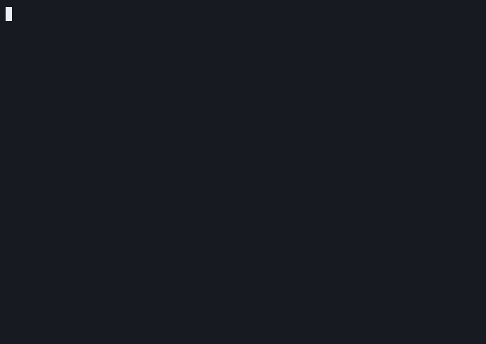
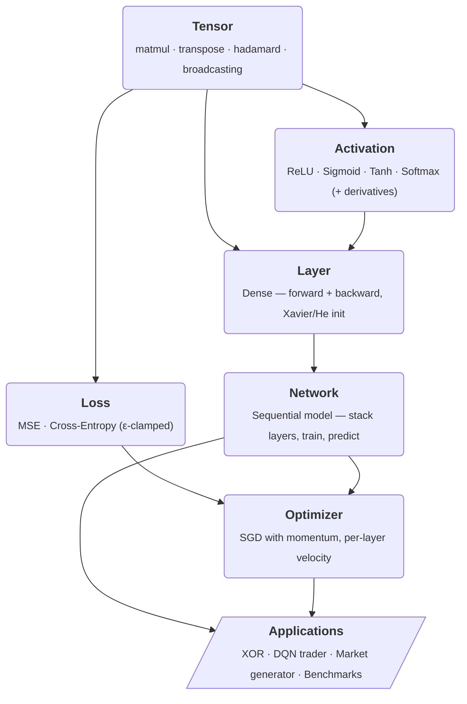

<picture>
  <source media="(prefers-color-scheme: dark)"  srcset="docs/banner-dark.png">
  <source media="(prefers-color-scheme: light)" srcset="docs/banner-light.png">
  
</picture>

[](https://github.com/Builder106/qforge/actions/workflows/ci.yml)
[](https://en.wikipedia.org/wiki/C99)
[](LICENSE)
[](tests/)
[](https://emscripten.org)
[](https://qforge-neural.vercel.app)

> An AI that learns to trade stocks — built entirely from scratch in C, with no libraries.

## What This Does

This project builds a **brain for trading** from the ground up — no TensorFlow, no PyTorch, no dependencies at all. Just raw C code that:

1. 🧠 **Learns patterns** — A neural network trained on market data that generates realistic fake stock returns for [stress-testing portfolios](https://www.cfainstitute.org/)
2. 📈 **Makes trades** — An AI trading agent that learns when to buy, sell, or hold — and **outperforms a passive buy-and-hold strategy**
3. ⚡ **Runs fast** — Matrix math optimized to process 2,400 million operations per second on a single CPU core

Everything — the math engine, the learning algorithms, the trading logic — is written by hand in ~2,000 lines of C.

---

## Demo

> **Try it live in your browser:** [qforge-neural.vercel.app](https://qforge-neural.vercel.app) — every demo below runs as WebAssembly with no install. The GIFs are recorded asciinema sessions of the native binaries.

### `$ make dqn` — Reinforcement-learning trading agent


### `$ make market_gen` — Synthetic market data generator



<details>
<summary><strong>More demos</strong> — XOR convergence and matmul benchmarks</summary>

### `$ make examples` — XOR (the classic hello-world of neural networks)



### `$ make bench` — Matmul + training-step throughput



</details>

---

## Quick Start

```bash
git clone https://github.com/Builder106/qforge.git
cd qforge
make test         # 56 unit tests — all should pass
make dqn          # Train the AI trading agent (~30 sec)
make market_gen   # Generate synthetic market data (~20 sec)
```

### All Commands

| Command | What it does |
|---------|-------------|
| `make test` | Run 56 unit tests (engine + scenario tests) |
| `make integration` | Black-box tests of the compiled example binaries |
| `make dqn` | Train the AI trading agent |
| `make market_gen` | Generate synthetic market data |
| `make examples` | Train on the XOR problem (hello world of AI) |
| `make bench` | Measure computation speed (MFLOP/s) |
| `make gradcheck` | Verify math correctness via finite differences |
| `make wasm` | Build every example as a WebAssembly module |
| `make e2e` | Run the Playwright + Gherkin E2E suite |
| `make memcheck` | Check for memory leaks |

---

## How It Works

The project has two layers: a **core engine** (the neural network library) and **applications** that use it.

### Core Engine

Built bottom-up from raw matrix math to a complete learning system. Every arrow is a real `#include`:



Six modules, ~2,000 lines total. Each one is independently testable — the [56-test unit suite](tests/) walks bottom-up, the same way the code was built.

### Application 1: Synthetic Market Data Generator

Hedge funds use AI to generate **fake but realistic** market data for stress-testing their portfolios against scenarios that haven't happened yet. This application:

- Trains on a [GARCH(1,1)](https://en.wikipedia.org/wiki/GARCH) process calibrated to S&P 500 daily returns
- The neural network learns to predict the next day's return from the previous 5 days
- Generated data preserves the **stylized facts** of real financial data:
  - **Fat tails** — extreme moves happen more often than a normal distribution predicts
  - **Volatility clustering** — big moves tend to follow big moves
  - **Negative skewness** — crashes are sharper than rallies

### Application 2: DQN Trading Agent

A reinforcement learning agent that learns to trade by trial and error — no human rules, just rewards:

- Uses **Deep Q-Learning** — the same technique DeepMind used to [beat Atari games](https://deepmind.google/discover/blog/deep-reinforcement-learning/)
- **Experience Replay Buffer** — remembers past trades and learns from a random mix of them
- **Epsilon-Greedy Exploration** — starts by making random trades, gradually shifts to using what it's learned
- **Target Network** — a frozen copy of the AI, updated periodically, that provides stable learning targets
- Tested against a **buy-and-hold baseline** — the simplest possible strategy

---

## Technical Details

<details>
<summary><strong>Architecture diagram</strong></summary>

```
┌──────────────────────────────────────────────────────────────────────┐
│                        C-Neural-Engine                               │
├──────────┬──────────┬──────────┬──────────┬──────────┬──────────────┤
│  Tensor  │ Activate │   Loss   │  Layer   │ Network  │  Optimizer   │
│          │          │          │          │          │              │
│ • create │ • relu   │ • mse    │ • dense  │ • create │ • sgd        │
│ • matmul │ • sigmoid│ • cross- │ • fwd    │ • fwd    │ • momentum   │
│ • transp │ • tanh   │   entropy│ • bwd    │ • bwd    │ • step       │
│ • add    │ • softmax│ • derivs │ • xavier │ • predict│              │
│ • hadam. │ • derivs │          │ • he     │          │              │
└──────────┴──────────┴──────────┴──────────┴──────────┴──────────────┘
```
</details>

<details>
<summary><strong>Performance benchmarks</strong></summary>

```
  Operation         │ Avg Time   │ Throughput
  ──────────────────┼────────────┼──────────────────
  matmul    32×32   │   0.029 ms │  2,256 MFLOP/s
  matmul    64×64   │   0.217 ms │  2,417 MFLOP/s
  matmul   256×256  │  22.70  ms │  1,478 MFLOP/s
  matmul   512×512  │ 158.67  ms │  1,692 MFLOP/s
  ──────────────────┼────────────┼──────────────────
  train  16→32→1    │   0.011 ms │  (full fwd+bwd+sgd)
  train  64→128→10  │   0.105 ms │
  train  256→512→32 │   3.015 ms │
```
</details>

<details>
<summary><strong>Gradient verification</strong></summary>

Backpropagation correctness validated against central finite differences:
`dL/dw ≈ [L(w+ε) - L(w-ε)] / 2ε`

```
  Test 1: [2→3(σ)→1(σ)]           — all passed (max rel error: 1.17e-08)
  Test 2: [4→8(relu)→4(relu)→2(σ)] — all passed (max rel error: 2.33e-07)
  Test 3: [3→5(none)→2(none)]      — all passed (max rel error: 3.50e-10)
  Test 4: [2→4(tanh)→1(σ)]         — all passed (max rel error: 2.56e-10)

  ✓ All gradient checks passed. Backpropagation is numerically correct.
```
</details>

<details>
<summary><strong>Numerical stability</strong></summary>

- **Softmax**: Subtracts row-max before `exp()` to prevent overflow
- **Sigmoid**: Branches on sign to avoid large negative exponents
- **Cross-Entropy**: Clamps predictions to `[ε, 1-ε]` to avoid `log(0)`
- **Weight Init**: Xavier (sigmoid/tanh) and He (ReLU), auto-selected
</details>

<details>
<summary><strong>Memory management</strong></summary>

All tensor operations return **new** heap-allocated tensors. Callers are responsible for freeing via `tensor_free()`. Layer and network destructors cascade through all owned tensors. Verified leak-free with AddressSanitizer.
</details>

<details>
<summary><strong>API usage</strong></summary>

```c
#include "network.h"
#include "optimizer.h"
#include "loss.h"

// Create a 3-layer neural network
Network *net = network_create();
network_add_layer(net, 2, 8, ACT_RELU);      // Hidden 1
network_add_layer(net, 8, 4, ACT_RELU);      // Hidden 2
network_add_layer(net, 4, 1, ACT_SIGMOID);   // Output

// Optimizer: Stochastic Gradient Descent with momentum
Optimizer *opt = optimizer_create_sgd(0.01, 0.9, net);

// Training loop
for (int epoch = 0; epoch < 10000; epoch++) {
    Tensor *output = network_forward(net, input);
    Tensor *grad = loss_mse_deriv(output, target);
    network_backward(net, grad);
    optimizer_step(opt, net);
    // ... free tensors
}

// Cleanup
optimizer_free(opt);
network_free(net);
```
</details>

## Project Structure

```
C_engine/
├── include/                    # Core engine headers
│   ├── tensor.h                  matrix math
│   ├── activation.h              ReLU, Sigmoid, Tanh, Softmax
│   ├── loss.h                    MSE, Cross-Entropy
│   ├── layer.h                   dense layer (forward + backward)
│   ├── network.h                 sequential model
│   └── optimizer.h               SGD + momentum
├── src/                        # Engine implementation
├── tests/                      # 56 unit tests (TDD) + integration script
│   └── test_harness.h            custom zero-dep test framework
├── examples/                   # Applications
│   ├── market_generator.c        synthetic market data
│   ├── dqn_trader.c              reinforcement learning trader
│   ├── xor.c                     classic AI proof-of-concept
│   ├── benchmark.c               performance measurement
│   └── gradient_check.c          mathematical correctness
└── docs/
    └── PRD.md
```

## Requirements

- GCC or Clang (C99)
- macOS or Linux
- No other dependencies

## License

MIT
